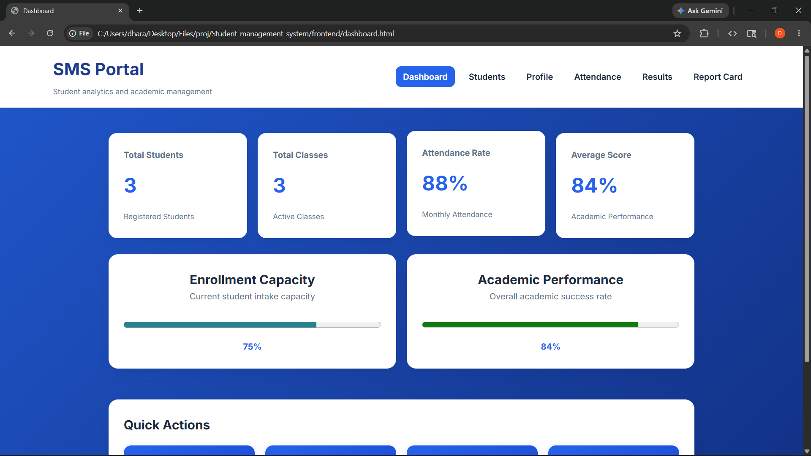
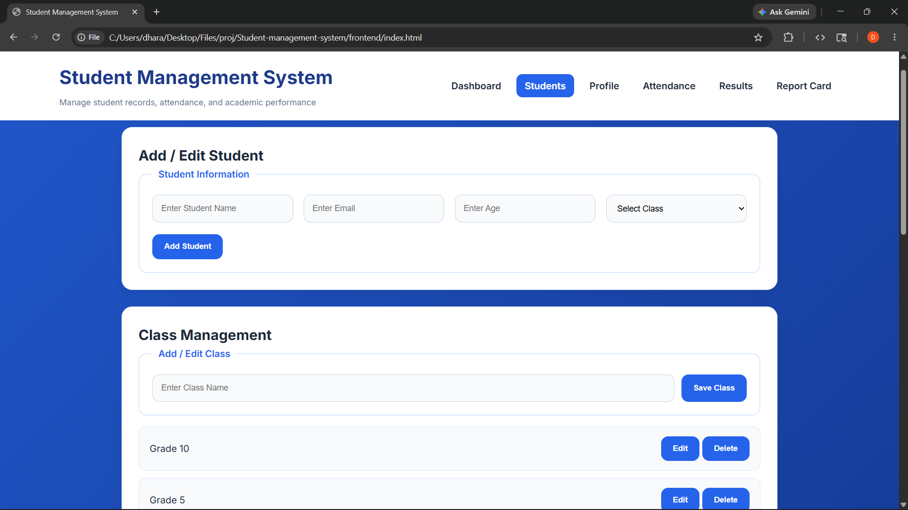
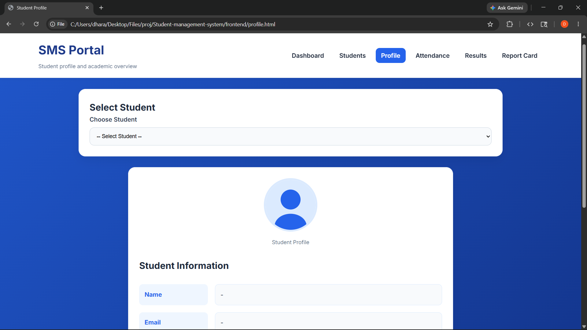
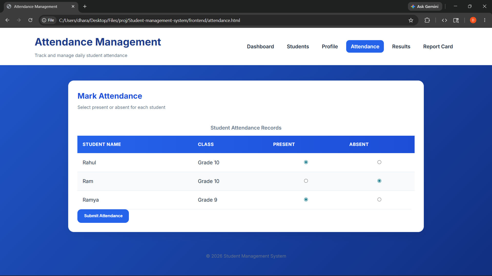
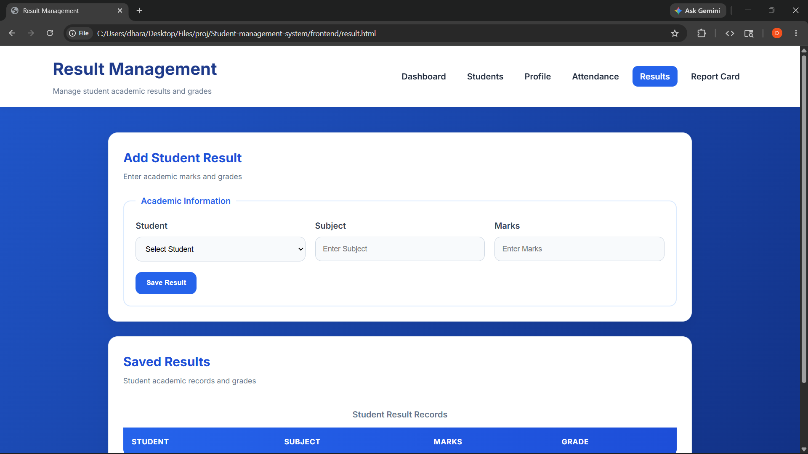
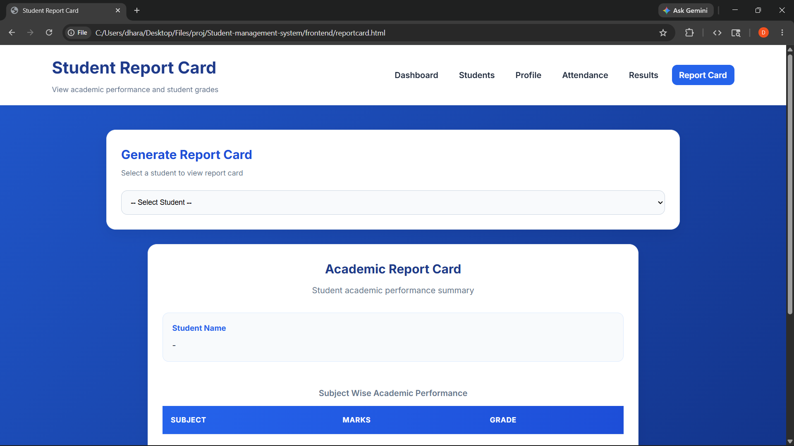

# Student Management System

A full-stack web application to manage student records, attendance, academic results, and report cards. Built using HTML5, CSS3, JavaScript on the frontend and Node.js, Express.js with MySQL on the backend.

## Tech Stack

- **Frontend:** HTML5, CSS3, Vanilla JavaScript
- **Backend:** Node.js, Express.js
- **Database:** MySQL (Sequelize ORM)

## Features

- Add, edit, and delete student records
- Class management
- Attendance tracking with present/absent marking
- Result management with automatic grade calculation
- Student profile with academic performance overview
- Printable report cards with subject-wise marks
- Search with autocomplete, sort by name/age, and pagination
- Fully responsive design for mobile and desktop

## Screenshots

### Dashboard


### Student Records


### Student Profile


### Attendance


### Results


### Report Card


## Project Structure

```
student-management-system/
├── frontend/
│   ├── dashboard.html
│   ├── index.html
│   ├── profile.html
│   ├── attendance.html
│   ├── result.html
│   ├── reportcard.html
│   ├── style.css
│   └── script.js
└── student-management/
    ├── config/
    ├── controllers/
    ├── models/
    ├── routes/
    ├── server.js
    └── .env
```

## Run Locally

### Prerequisites
- Node.js installed
- MySQL installed and running

### Backend Setup

```bash
cd student-management
npm install
```

Create a `.env` file inside `student-management/`:

```env
PORT=5000
DB_HOST=localhost
DB_USER=your_mysql_username
DB_PASSWORD=your_mysql_password
DB_NAME=student_db
```

Start the backend:

```bash
node server.js
```

### Frontend Setup

Open `frontend/index.html` directly in your browser.

Make sure backend is running on `http://localhost:5000` before opening the frontend.

## Author

dharu-dharanic
[GitHub Profile](https://github.com/dharu-dharanic)